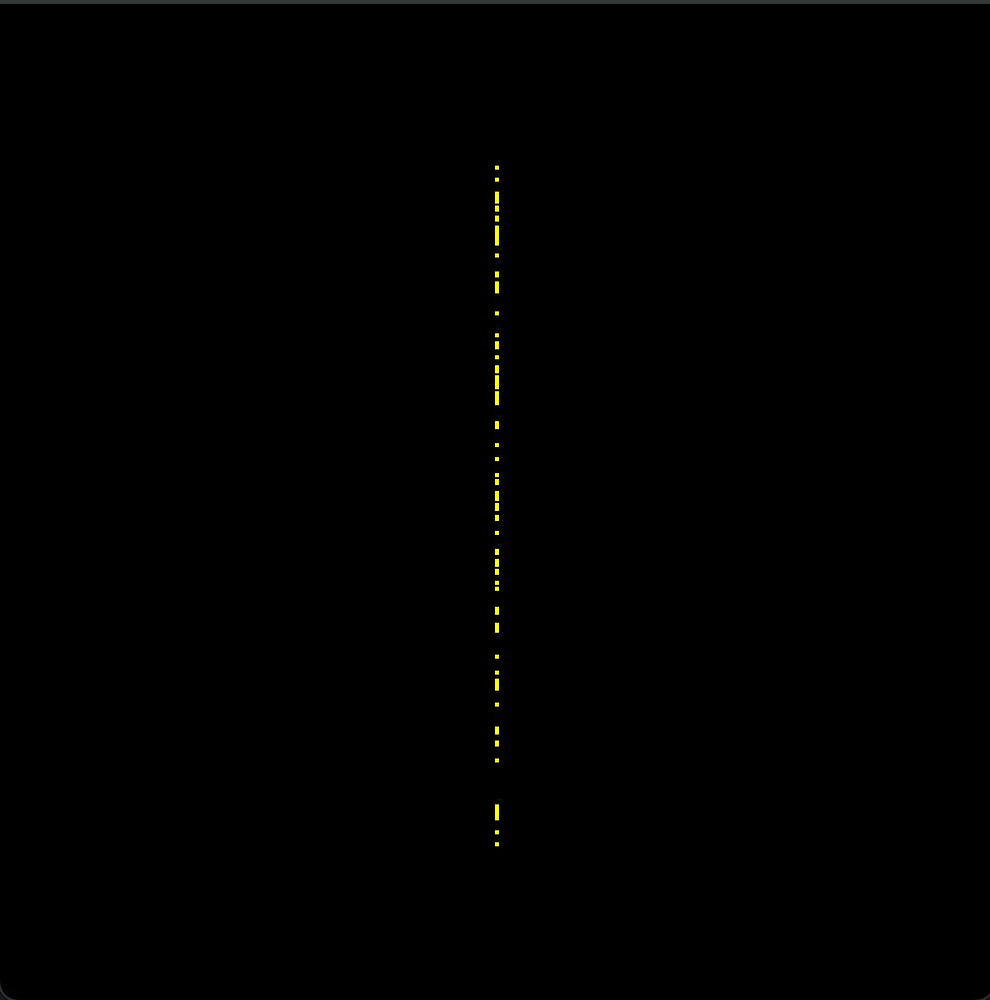
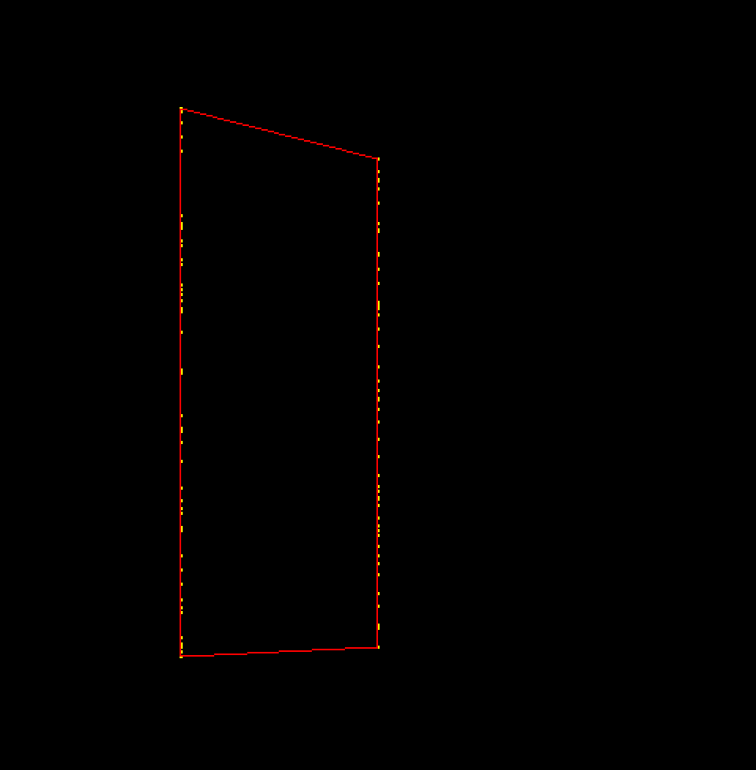
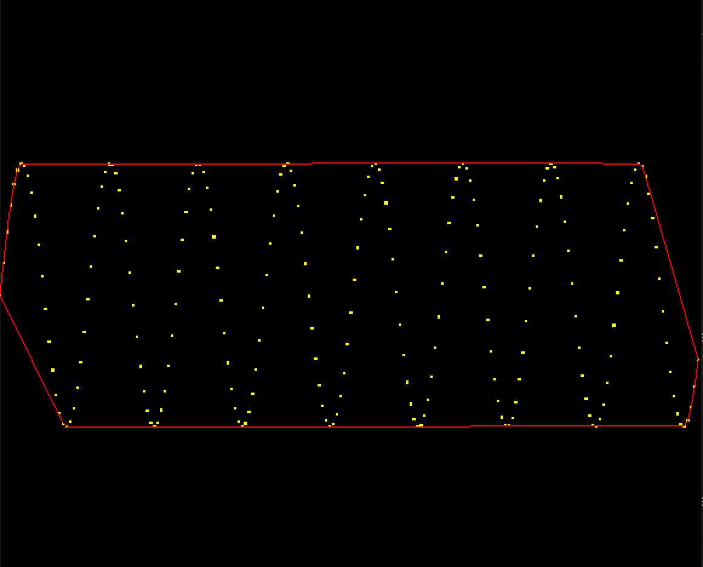
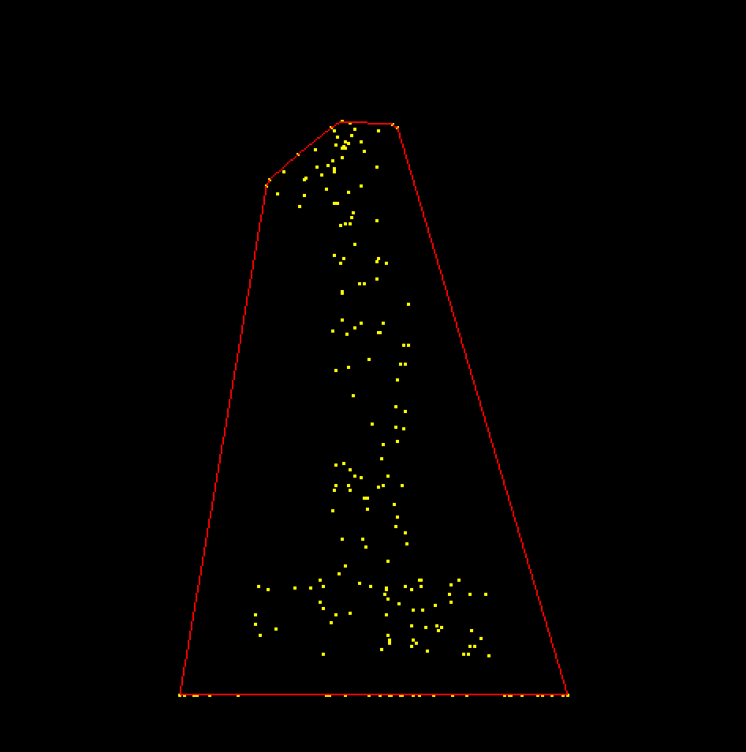
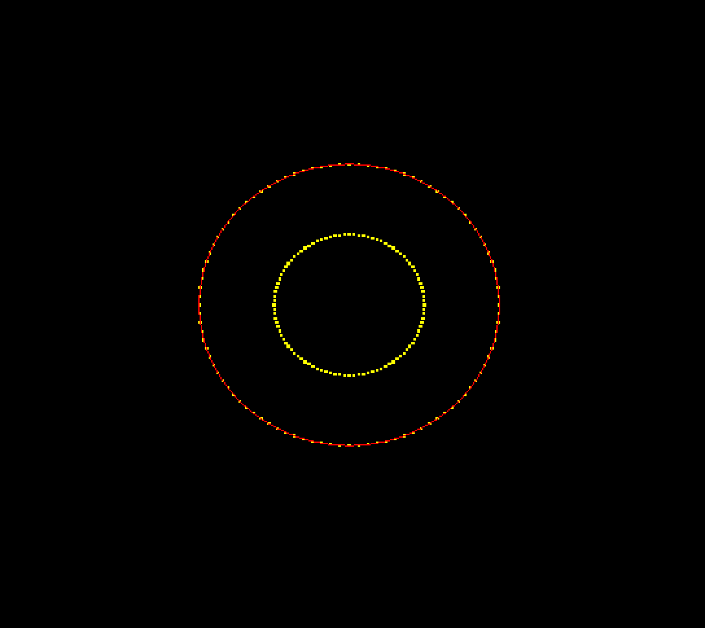

## Degenerate Inputs
1. Collinear points (>=3) on the convex hull
    - Only keep the first and the last points in that set of collinear points in the order we encounter them
2. Generated less than 3 distinct points
    - Only draw hull if there is at least 2 points in hull (the data structure that stores the points constituting the convex hull)
3. All generated points are collinear (e.g. vertical_line, horizontal_line)
    - Because of how we handle case 1, the hull data structure will only hold 2 points. So, this case eventually falls back to case 2.

## Image of OUR customized initializers
`initialize_points_vertical_line()`

`initialize_points_two_vertical()`

## Image of CLASSMATES' initializers
`initialize_points_wave()`

`intialize_points_1()`

## Convex Hulls Images:

`initialize_points_circle(points, NPOINTS) `

`initialize_points_cross(points, NPOINTS)`
`initialize_points_horizontal_line(points, NPOINTS)`
`initialize_points_random(points, NPOINTS)`
`initialize_points_vertical_line(points, NPOINTS)`
`initialize_points_two_vertical(points, NPOINTS)`
`initialize_points_heart(points,NPOINTS)`
`initialize_points_1(points,NPOINTS)`
`initialize_points_2(points,NPOINTS)`
`initialize_points_thin_cross(points,NPOINTS)`
`initialize_points_triangle(points,NPOINTS)`
`initialize_points_hexagon(points, NPOINTS)`
`initialize_points_wave(points, NPOINTS)`

## Known Bugs:
N/A

## Extra Features:

## Time Allocation:

### Thinking:
### Programming:
### Testing:
### Documenting:
### Total:

## Reflection:
### How challenging did you find this project? 

### Learning outcomes:

### Team Work Reflection:

### Future Work: