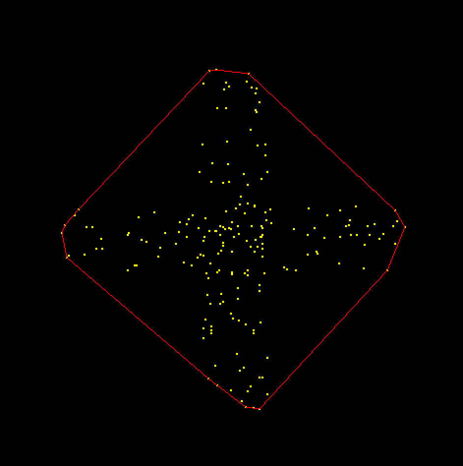
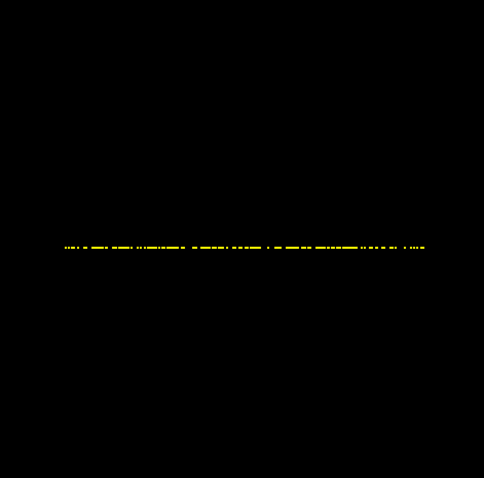
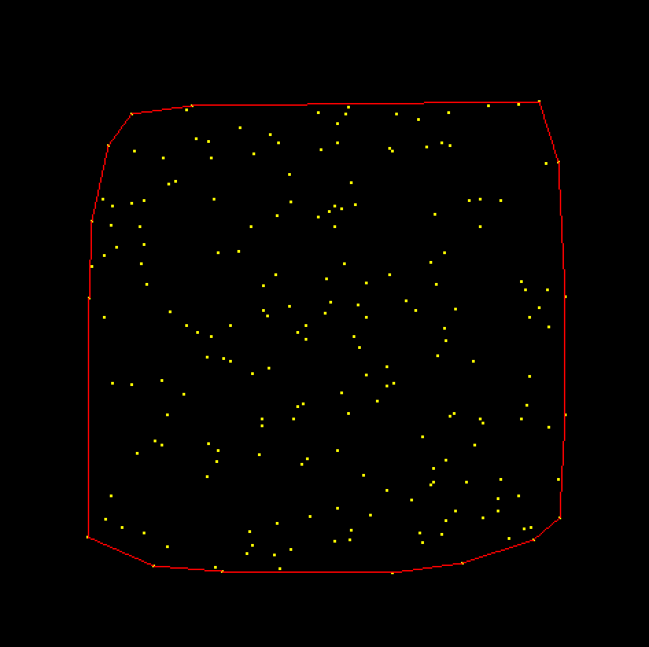
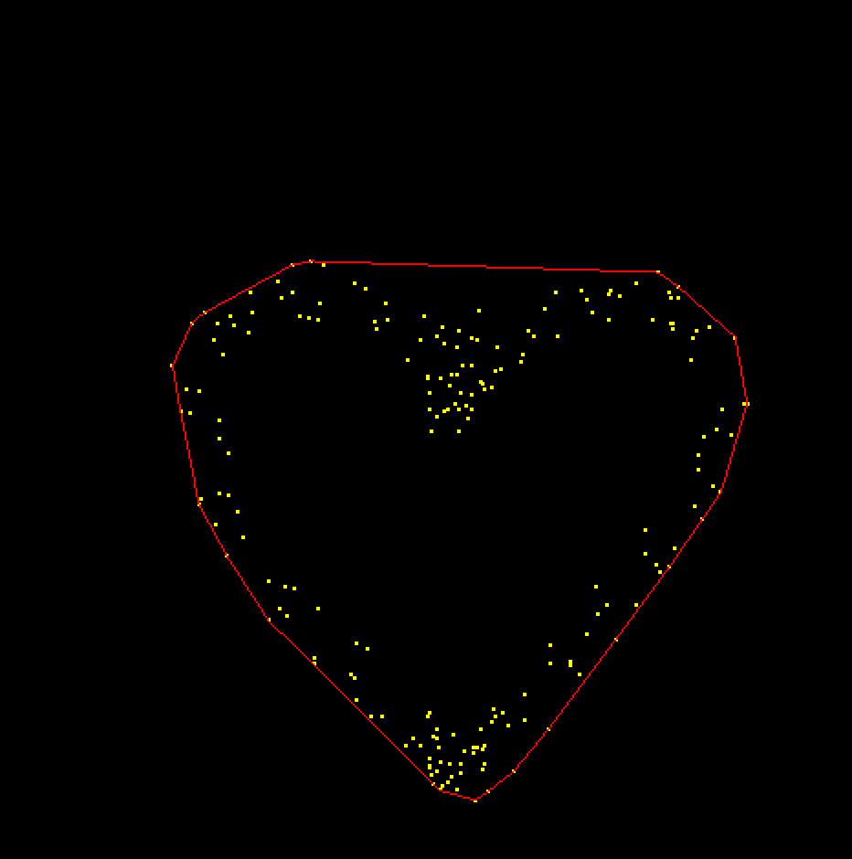
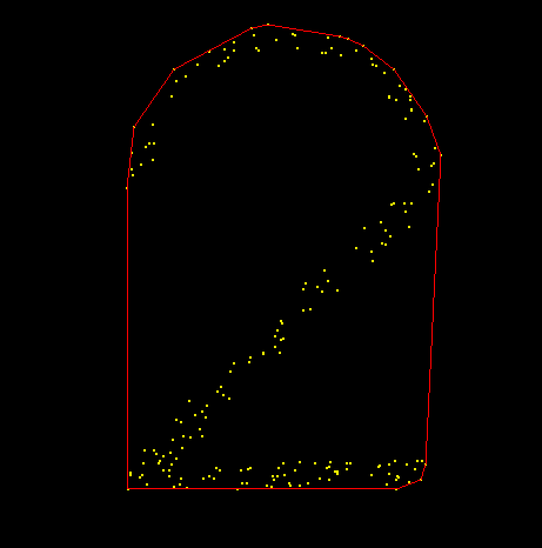
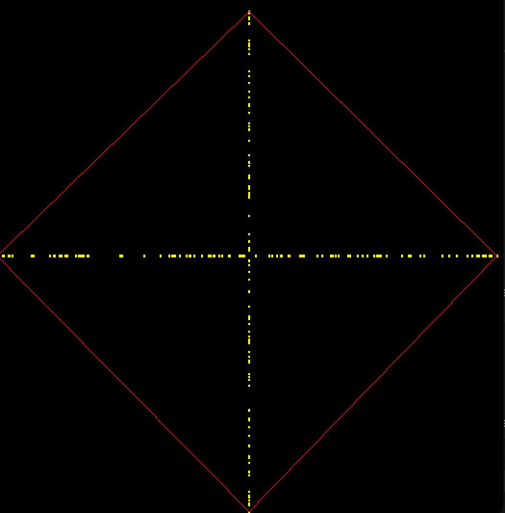
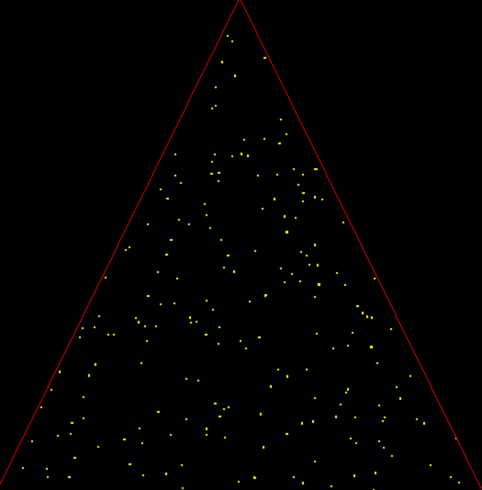
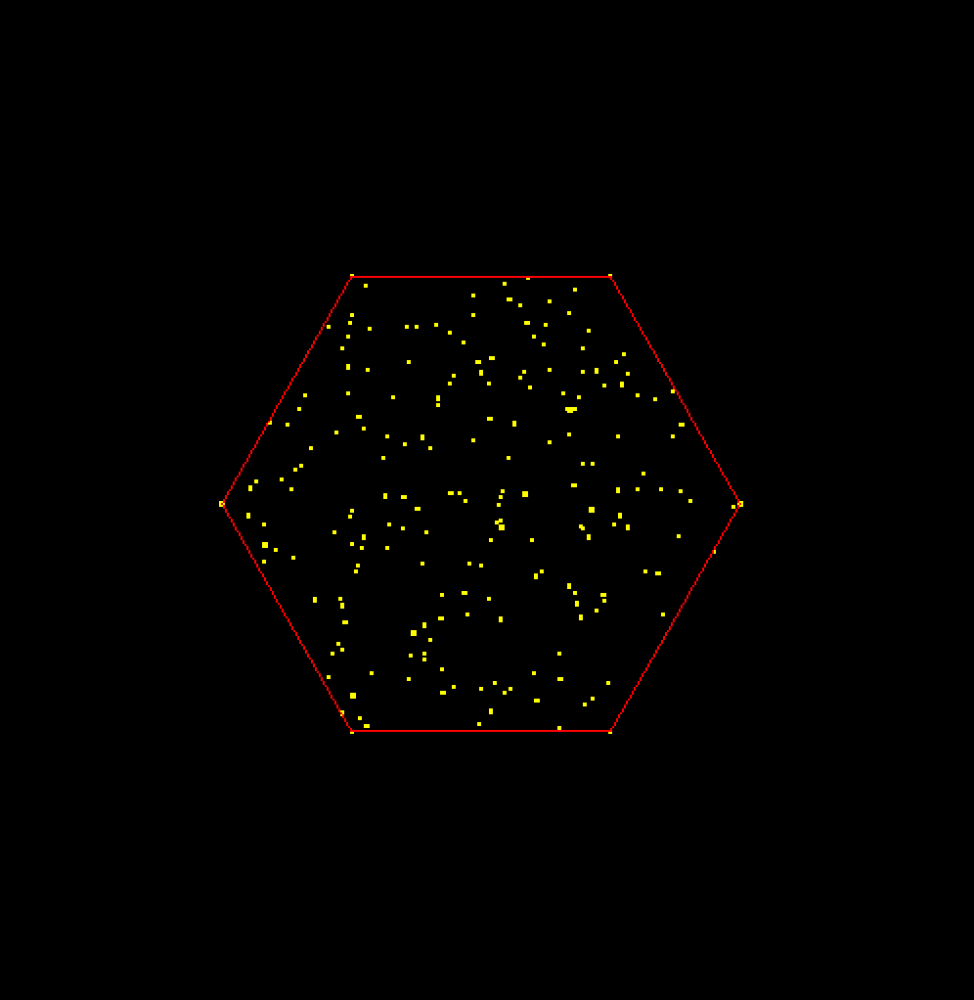

## Degenerate Inputs
1. Collinear points (>=3) on the convex hull
    - Only keep the first and the last points in that set of collinear points in the order we encounter them
2. Generated less than 3 distinct points
    - Only draw hull if there is at least 2 points in hull (the data structure that stores the points constituting the convex hull)
3. All generated points are collinear (e.g. vertical_line, horizontal_line)
    - Because of how we handle case 1, the hull data structure will only hold 2 points. So, this case eventually falls back to case 2.

## Image of OUR customized initializers
`initialize_points_vertical_line()`

`initialize_points_two_vertical()`

## Image of CLASSMATES' initializers
`initialize_points_wave()`

`intialize_points_1()`

## Convex Hulls Images:

`initialize_points_circle(points, NPOINTS) `

`initialize_points_cross(points, NPOINTS)`

`initialize_points_horizontal_line(points, NPOINTS)`

`initialize_points_random(points, NPOINTS)`

`initialize_points_vertical_line(points, NPOINTS)`

`initialize_points_two_vertical(points, NPOINTS)`

`initialize_points_heart(points, NPOINTS)`

`initialize_points_1(points, NPOINTS)`
`intialize_points_1()`

`initialize_points_2(points,NPOINTS)`
`intialize_points_2()`

`initialize_points_thin_cross(points,NPOINTS)`

`initialize_points_triangle(points, NPOINTS)`

`initialize_points_hexagon(points, NPOINTS)`

`initialize_points_wave(points, NPOINTS)`

## Known Bugs:
N/A

## Extra Features:
N/A 

## Time Allocation:

### Thinking: 
4 hours

### Programming: 
8 hours

### Testing: 
4 hours

### Documenting: 
4 hours

### Total: 
20 hours

## Reflection:
### How challenging did you find this project? 
Medium hard. (Reasonable)

### Learning outcomes:
Increased proficiency in C++;
int / int returns int
Familiarize with C++ stack and vector structure;
How to calculate angles between 2 points;
Technique: use episilon to solve double overflow issues.

### Team Work Reflection:
Great. Learned a lot!

### Future Work:
Change the color of the convex hull.
Truely randomize of the points.
Allow non-distinct points to be generated.
Extend the problem to 3d.
